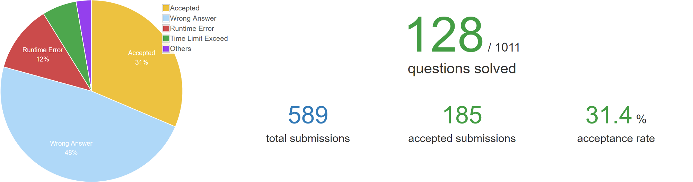
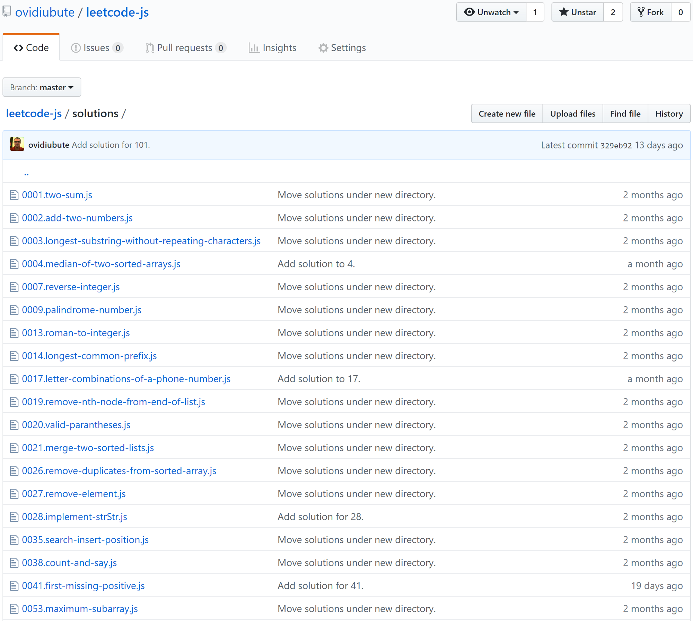
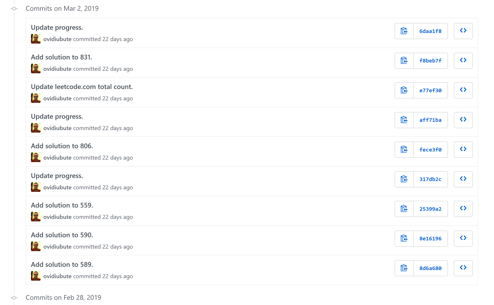

Solving programming exercises that require algorithms and data structure knowledge has never been my strong point. Despite this fact, I've had a relatively successful career in software development for the past ten years. I never needed to be very good at algorithms because I never needed them at the companies I worked for. But the past few years have taught me a hard lesson.

**Computer science fundamentals is not something you should avoid or ignore.**

---

## Simpler times

Let me back up a bit. In high school I was part of a class that was specialized in computer science and English — I'm Romanian, so foreign languages is something we need to get good at to succeed. The curricula was decent. We wrote code in Pascal, which wasn't the best choice maybe compared to C or C++, but it wasn't a hindrance in solving programming problems. I learned the imperative paradigm, sorting algorithms, data structures such as arrays, graphs, and trees, techniques such as *backtracking* and *divide et impera*, and more.

By the 12th grade, which is senior year in Romanian high school, I thought I had a good command of CS fundamentals. I enjoyed writing code, even though I was pretty bored of not being able to visualize output in any graphical way. This is what eventually drove me towards front-end development years later.

I never participated in [olympiads](https://en.wikipedia.org/wiki/International_Olympiad_in_Informatics) or other competitive events. Somehow, even though I liked programming, I didn't see the point of them. Thinking back I now realize this was a mistake, and it probably affected my career more than I'd care to admit.

I took an entrance exam and was admitted to the [Academy of Economic Studies in Bucharest](http://csie.ase.ro/home), majoring in computer science and economics. This particular bachelor's degree helped me with knowledge regarding several programming languages such as C++, Java or C#, however in the area of algorithms and data structures, the curricula was pretty light. I would say it was on par with senior high-school year. Which basically for me meant that I couldn't progress just by doing course work.

In my 2nd year of university I decided to get a part-time job as a software developer in test. I wasn't really applying anything I had learned in school though (what a shocker, right?). I continued my career at a few startups, and I gradually forgot everything I ever knew about algorithms and data structures. My jobs didn't really demand it. The tasks were always related to using frameworks, writing code without any performance constraints, or maintaining legacy systems. But I was growing as a developer. I was being promoted, praised in yearly reviews, and I got good at applying design patterns and writing clean, testable code.

---

## Success

How exactly do you measure your success as a software developer? If you work for a company that produces software, and you're constantly solving your tasks ahead of schedule, getting promoted up the individual contributor track, would you think you're actually stagnating?

Yet most business software development is built in such a way that developers are interchangeable and the ramp up is cheap and fast. This is advantageous for companies, and enthusiastic for most developers, especially junior ones. You don't need a CS degree to write code using frameworks such as Spring or Django. You just need to be able to read documentation, use a modern IDE, and get through some on the job training on how to write tests and contribute to the project.

I have never once had to think about the complexity of the code I was writing. Most systems I was working on did not have that much traffic, and the ones that did — they worked around it by throwing money at the problem via over-provisioned servers.

I stated that CS fundamentals is a topic you absolutely need to get good at. Let me explain why. There are limits to how far you can go career wise without ever learning seemingly boring stuff like what is a self balancing tree, or what it means for a sorting algorithm to be stable. I think the fact that you can progress so far and so quickly in software without this knowledge is a big problem. It can lure you into a sense of false security which will hit you painfully at some point.

For me that point was when I started working at [Hootsuite](https://hootsuite.com/). The nature of the problems I faced immediately after I was hired were exponentially more difficult than anything I've ever seen before. Performance was at the heart of everything we had to do. And this is where algorithms and data structures become increasingly relevant. You can certainly take a matrix sized 50x1000 and loop through all of it once per each item you're searching for. This is made insanely easy by using libraries such as [Lodash](https://lodash.com/) or [Underscore](https://underscorejs.org/). You may even get away with it in most cases. But if you're dealing with a large piece of software, with lots of things happening all at once either on screen or behind the scenes, in your back-end code, efficiency is mandatory. Caring about it will also distinguish you from other developers.

Working in a performance oriented team is extremely challenging, but it can also be the most rewarding experience in your career. I figured that out eventually, but I spent years in companies that never pushed me hard enough to become a better software developer. I spent time reading and applying design and testability patterns, which certainly helped. But the reality is you can have a beautifully architected system that just isn't scalable. And you can't Google how to get there. You can't Stack Overflow your way to writing efficient code.

After I was hired I decided that I needed to freshen up my CS fundamentals fast. So I devised a plan.

---

## The Goal

I'm still a bit old fashioned when it comes to studying material, so I bought [Algorithms Fourth Edition, by Sedgewick & Wayne](https://algs4.cs.princeton.edu/home/). I wish I had this book when I was still in school. It is very different than any textbook I've ever used. It doesn't just force feed you algorithms, it offers so much context around why we even have algorithms, or how to measure them. It also presents a real world problem before presenting the solutions, which is contrary to pretty much how my entire education system was (and still is) designed. By structuring the chapters like this I finally understood the importance of starting with a basic algorithm, which may not be very good, and evolving it until you get to an optimal solution. This is also how major companies run their technical interviews.

I felt pretty good as I progressed through the chapters, there were a lot of things that I had previously read but forgot, and there were certain algorithms which I had never even heard about. It was starting to make sense, and I was happy with my progress.

Then I decided that I needed some coding practice. It's one thing to read about a tree, but quite a different one to be able to solve a programming problem involving one. I discovered [leetcode.com](https://leetcode.com/), a competitive programming platform which is free to join (with an optional premium tier) and offers hundreds of problems.

Merging intervals in JavaScript

I decided on the spot that I had to set a goal for myself, otherwise this would just end up like my list of GitHub repositories. Exciting at first, but ultimately abandoned in my endless to-do list of ideas and projects. I thought I had to make the goal very easy to measure, and ambitious enough such that it would force me to work hard enough to achieve it.

So I settled on solving 100 Leetcode problems by mid 2019. This number felt high enough that I'd need to work for it, but still low enough such that I didn't have to go out of my way and pull all-nighters. The only time I could work on this was from home, and that pretty much means just the weekends.

---

## Tracking

Leetcode's stats page

Leetcode makes it trivial to measure your progress with a pie chart of completed versus total number of problems. But the profile page is a bit hidden, and you need an account to be able to even access someone else's stats. This was mildly annoying, but the second problem I found was much worse. Your solutions in the platform are not easily searchable after the fact. You need to either have the code in your browser's local storage, or go to the submissions page of each problem and find it. As I was still struggling with problems, I needed a fast way to go back to a previously solved solution for help, and Leetcode wasn't making this easy.

So I decided I was going to host all of my solutions in a GitHub repository. I figured it was OK to do that since I would only be publishing the accepted solutions source code, not the problem description, which rightfully belongs to Leetcode under a license.

The repository is located at https://github.com/ovidiubute/leetcode-js

All of the solutions are located in a single directory, and I used a simple naming scheme to track problem IDs and titles. This maintains a certain tidiness and it also makes it easy to search for solutions directly in GitHub.

I used JavaScript as my language. This could be an article topic on its own, as there are many caveats to using JS for this type of work. But it's been too long since I've written C or Java and I write code in TypeScript every day at work, so it seemed like a logical choice. The main drawback is you have none of the advanced data structures such as HashSets, Heaps, or Queues. When faced with a problem that requires them you're pretty much on your own and have to re-implement them.

https://github.com/ovidiubute/leetcode-js

I also implemented a badge on the repository's Readme that tracks progress as a percentage. This was a fun little side project that meant learning how the [shields.io endpoint](https://shields.io/endpoint) system worked. Whenever I contribute a solution, I run a Node.js program that updates a JSON file in my repo. This is then accessed by shields.io and their systems read the badge, text, colors, and percentage, rendering an SVG similar to the one below.

My custom GitHub Leetcode progress badge

---

## Results

I hit my milestone way before my target deadline. This was both good and bad for me, as on one hand, I was completely stocked that I was able to solve 100 problems given my years of neglecting algorithms and data structures. But on the other hand, I had aimed way too low, which felt a bit disappointing.

Setting a tangible goal forced me to take this task seriously. Measuring it made it easy and also comforting as I could see my progress from one week to another. However I made two mistakes when defining the goal. I didn't think to split the goal by difficulty of the problems. Leetcode offers problems in three difficulties, and I gamed my own system by solving a lot more easy problems than medium, or difficult. Granted, it's ironic for me to say that given that when I started a few months ago, the easy level felt impossible. I had forgotten so much from school that it felt like my goal was a cruel joke I had made myself suffer through.

Gradually it got better, though. Had I not been so dismissive of my own skills, I would've set a harder goal. Something like solve 80/30/15 problems, split by difficulty. I also should've pushed myself for a tighter deadline.

Did it matter that I spent this time remembering things that I only rarely use in my day to day job? Well, from what I can tell, I'm much more attuned to how my code performs now. Writing efficient code is something you don't just get good at by solving a few coding tasks, but the difference between my mindset now and how I used to think six months ago is significant.

I also appreciated the exercise. Coding is not just thinking about ways of solving problems. There's a mechanical element to it. By writing a lot of code your muscle memory improves, leading to faster typing of repetitive patterns. You shouldn't have to think about how to traverse the diagonal of a matrix, or how to remove duplicates from an array.

## Recap

So I went from studying computer science in high school, to sort of continuing to study it in university, to rarely applying what I had learned on the job, to a new job demanding I get good at it again. A typical week-end day for me looks like this:

But I absolutely enjoy working on it! I got into programming because of the exhilarating feeling of asking a computer to do something. At first it was printing text on the screen. Then answering an HTTP request. Then animating a sprite on a mobile phone. The feeling is still there, but it took me a long time to realize that everything is built on top of the same foundation. Languages and frameworks are transient. They change, they die, they get replaced. As a junior developer I was convinced that keeping up with these changes was a sure way to achieve success. I worked for many companies that rewarded this behavior. I had never worked for one that rewarded being good at the foundation layer. Now I do and I need to catch up on some wasted time.
